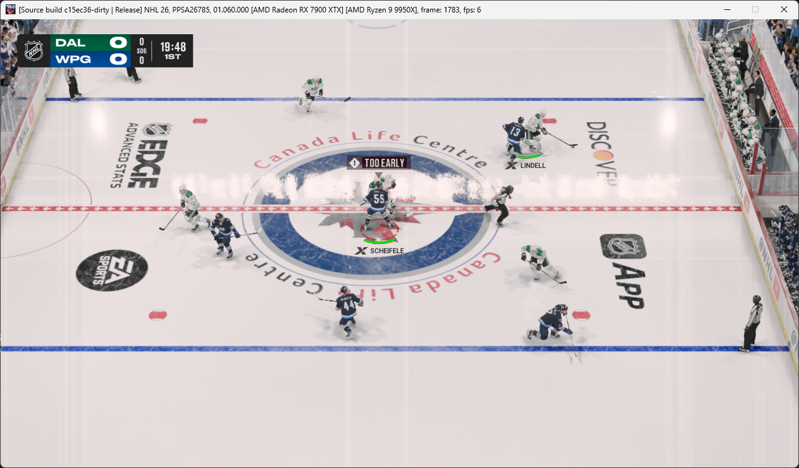
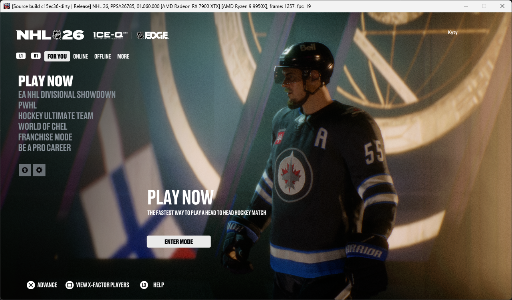
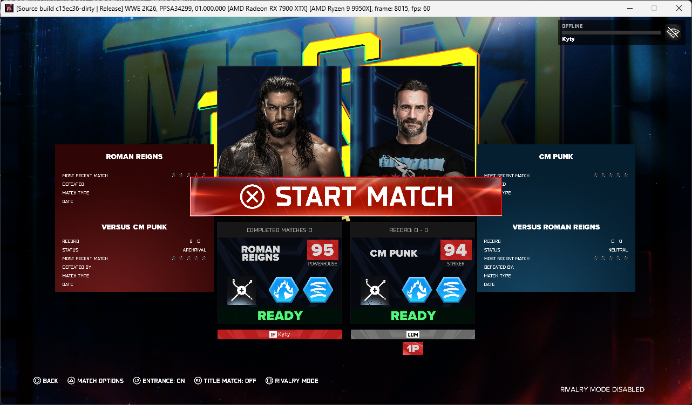
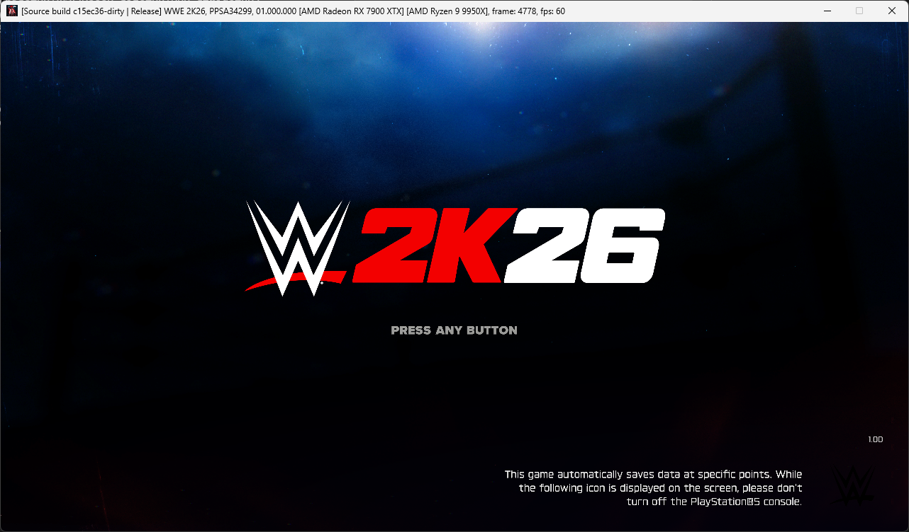

# KytyPS5

[](https://github.com/KytyPS5/KytyPS5/actions/workflows/build.yml)
[](https://github.com/KytyPS5/KytyPS5/actions/workflows/build.yml)
[](https://github.com/KytyPS5/KytyPS5/actions/workflows/build.yml)
[](#system-requirements)
[](#current-status)
[](LICENSE)

KytyPS5 is a free and open-source PlayStation 5 emulator written in C++. Build steps, requirements
and usage are in the [full project README](#full-project-readme) at the bottom of this page.

> [!IMPORTANT]
> KytyPS5 is not affiliated with Sony Interactive Entertainment or PlayStation. Use only game files
> that you have obtained legally.

## Game status

| Game      | Status    | Average FPS |
| --------- | --------- | ----------- |
| WWE 2K26  | Main menu | 60 FPS      |
| NHL 26    | In game   | 10 FPS      |

This was tested and results given by: **AMD Radeon RX 7900 XTX, AMD Ryzen 9 9950X, 64 GB RAM**.

FPS values are approximate averages and will change as work continues.

## Screenshots

<table align="center">
  <tr>
    <td align="center">
      <strong>NHL 26: In game</strong><br>
      
    </td>
    <td align="center">
      <strong>NHL 26: Menu</strong><br>
      
    </td>
  </tr>
  <tr>
    <td align="center">
      <strong>WWE 2K26: Main menu</strong><br>
      
    </td>
    <td align="center">
      <strong>WWE 2K26: Title screen</strong><br>
      
    </td>
  </tr>
</table>

## Reduce stutter with shader pre-generation

The first time a game uses a shader, the emulator has to compile it, and the game freezes briefly
while it waits. This shows up as hitches in menus and when a match loads. In one measured second
of an NHL 26 menu, compiling 53 pipelines and 66 shaders took over 1.2 seconds.

**Pre-generate shaders** records every shader and pipeline a game compiles. On later launches, the
emulator compiles all of them on several threads before the game starts, so they are ready
when the game asks for them.

To turn it on or off:

1. Open the launcher and edit the game's settings.
2. Go to **Performance & diagnostics**.
3. Check or clear **Pre-generate shaders**, then select **Save**.

It is on by default. The first run of a game still hitches while shaders are recorded. Later runs
boot a little slower while the recorded shaders compile, then play with far fewer hitches. The
records are kept in the `_PipelineCache` folder.

## Recent emulation improvements

### Rendering

- **Black ice in NHL 26.** Packed `R11G11B10` colour clears are now decoded. The game clears a
  lighting mask to 1.0, and the dropped clear left it at 0, which blacked out the rink.
- **Missing HUD and pause menu.** The compositor UI mask workaround also covers the in-match
  compositor, so the HUD is shown instead of drawn and discarded.
- **Wrong G-buffer outputs.** Pixel shader exports are packed onto the slots enabled in
  `CB_SHADER_MASK`, and colour writes to disabled slots are masked.
- **Sparkles and noise on fast-cleared targets.** CMask fast-clear colour targets are cleared
  instead of being filled with uninitialized guest memory.
- **Exploding cloth and skinned meshes.** Formatted buffer stores (F16, UNORM/SNORM, scaled) are
  encoded correctly instead of writing raw float32 bits, which produced half-float NaNs.
- **Pixel derivatives.** DPP quad-permutation moves are emulated with fine derivatives.
- **Crash when starting a match.** Stencil associations only reuse registered images, which fixes a
  `PageManager` write-watcher overflow.
- **Tessellated draws.** Patch draws are skipped unless **Tessellation** is enabled in the launcher,
  because NHL 26's hull shaders use operands the decoder does not support yet.

### Shader recompiler

- Added `V_FRACT_F16`, `V_CMPX_LT_U16` and SOP1 opcode `0x21`, and fixed the destination handling
  of `V_MIN_I32`.
- **Per-pixel texture lookups.** Shaders that pick a texture from a material table using a
  per-pixel value (NHL 26 reads it from G-buffer data) now compile. An unreadable table entry binds
  a null texture instead of stopping the emulator.
- Texture descriptors read from a buffer at a per-draw constant offset are now accepted, and
  out-of-bounds constant buffer reads return zero, matching the generated shader.
- Whole-value reads of the packed pixel ancillary input are rebuilt from the sample ID and layer.
- Fixed control-flow structurization for shaders that early-return and for shared join blocks that
  were misread as loop continues.
- Bounded the compare-exchange retry loop used for sub-dword stores at 4096 retries, so a lost race
  drops one store instead of hanging the GPU into `VK_ERROR_DEVICE_LOST`.
- A shader loop guard is on by default for the NHL 26 shaders known to hang. Compute shader
  `0873b3a2bce038b2`, which crashes the AMD pipeline compiler, is skipped by default. Both can be
  changed in the launcher's **Performance & diagnostics** settings.

### System libraries

- **NHL 26 loading loop.** Implemented the HTTP, HTTPS, NP and resolver exports the game called in
  an endless retry cycle, including `sceHttpGetLastErrno` and `sceHttpsGetSslError`. Before this,
  unresolved stubs reported success and left the error outputs uninitialized.
- **WWE 2K26 boot.** `AgcCreateShader` no longer relocates a shader header that is created twice.
  Added `sceKernelGetModuleList2`, `sceKernelGetModuleInfo2` and `sceKernelAioWaitRequests`, and
  stubbed unresolved AgcDriver, SharePlay and Pad imports.

### Performance

- **Shader pre-generation.** See [Reduce stutter with shader pre-generation](#reduce-stutter-with-shader-pre-generation).
- **Persistent Vulkan pipeline cache.** The cache is kept across builds and saved every 128 new
  pipelines, so a crash no longer loses it.
- **Lower per-draw overhead.** Debug labels are only formatted when **GPU debug labels** or the
  graphics debug dump is enabled.
- **Fewer redundant resource walks.** Buffer upload checks are skipped while no buffer has changed
  on the CPU, and resource materialization results are reused per shader.

### Launcher and diagnostics

- A new **Performance & diagnostics** settings page covers shader pre-generation, performance stats,
  validation, debug dumps, tessellation and the NHL 26 workarounds. Extra environment variables can
  be entered as `NAME=VALUE`, separated by `;`.
- **Performance stats in console** prints per-second draws, dispatches, submits, compiles, readbacks
  and time spent waiting on the GPU. Tracy captures include frame marks, plots and zones.
- Shader failures now explain themselves: failed resource tracking writes the shader IR to
  `shader_tracking_failure_<hash>.ir.txt`, and failed SRT walks and pipeline creation log the reason.
- Offline shader analysis scripts live in [`tools/shader_analysis`](tools/shader_analysis):
  `spv_loops.py` finds non-terminating loops, `spv_diff.py` compares two shader dumps and `nid.py`
  identifies unresolved imports by NID.

<sub>Claude and Codex were used for code review, reverse engineering and fixes.</sub>

## Full project README

<details>
<summary><strong>Original KytyPS5 README</strong></summary>

<br>

KytyPS5 is a free and open-source PlayStation 5 emulator written in C++ for Windows and Linux,
with experimental macOS support. It is based on a heavily modified version of
[Kyty](https://github.com/InoriRus/Kyty). The project is in an early stage of development, so
compatibility is limited and behavior may change significantly between builds.

> [!IMPORTANT]
> KytyPS5 is not affiliated with Sony Interactive Entertainment or PlayStation. The project does
> not distribute games or copyrighted system software. Use only game files that you have obtained
> legally.

## Current Status

KytyPS5 can boot 2D games and a selection of 3D games, including titles built with Unreal Engine
4/5, Unity, and custom engines. No external low-level emulation modules are currently required.

Development is focused on compatibility and boot reliability.

Windows is the primary platform and receives the most testing. Linux builds and runs; see
[Building on Linux](#building-on-linux).

macOS support is experimental. The emulator is built for x86-64 and runs on Apple Silicon under
Rosetta 2, with Vulkan provided by MoltenVK. A small number of titles have been verified in-game
on Apple Silicon hardware; see [Building on macOS](#building-on-macos).

Community game test results are available in the
[KytyPS5 Compatibility List](https://kytyps5.github.io/).

## Bugs and Issues

The project is in an early stage, so please be mindful when opening new issues. Expect crashes,
graphical glitches, low compatibility, and poor performance.

## Screenshots

<table align="center">
  <tr>
    <td align="center">
      <strong>Disgaea 6</strong><br>
      
    </td>
    <td align="center">
      <strong>Dreaming Sarah</strong><br>
      
    </td>
  </tr>
  <tr>
    <td align="center">
      <strong>Neptunia ReVerse</strong><br>
      
    </td>
    <td align="center">
      <strong>SILENT HILL: The Short Message</strong><br>
      
    </td>
  </tr>
  <tr>
    <td align="center">
      <strong>Hellboy</strong><br>
      
    </td>
    <td align="center">
      <strong>Paleo Pines</strong><br>
      
    </td>
  </tr>
</table>

<p align="center"><em>And many more...</em></p>

## Contributing

Testing games and submitting detailed bug reports are useful ways to contribute. Search existing
issues first, then use the **Game Emulation Bug Report** template and attach the complete log file.

Code contributions should be focused, build successfully on the platforms they touch, and include
relevant tests where practical. Windows is the primary target, so a change that alters shared code
should not regress it; changes confined to a platform's own code paths only need to build there. Because KytyPS5 is still evolving quickly, consider opening an issue before
starting a large change.

### Formatting

Set up the clang-format hook after cloning:

Install `pre-commit` using the method appropriate for your platform:

- **Arch Linux / CachyOS:** `sudo pacman -S pre-commit`
- **Other Linux / macOS / Windows:** `python -m pip install pre-commit`

Then install the Git hook:

```bash
python -m pre_commit install --install-hooks
```

It formats staged `.cpp`, `.h`, and `.inc` files in `src`.

## Developer Information

The PS5 graphics architecture is based on AMD RDNA 2. Use AMD's
[RDNA 2 Instruction Set Architecture Reference Guide (document 70648)](https://docs.amd.com/v/u/en-US/rdna2-shader-instruction-set-architecture)
as the primary instruction-encoding reference when working on shader decoding and recompilation.

Important areas of the codebase:

- [`src/graphics/shader/recompiler`](src/graphics/shader/recompiler) — instruction decoding,
  intermediate representation, control flow, resource tracking, and SPIR-V emission
- [`src/graphics/guest_gpu`](src/graphics/guest_gpu) — PS5 (Prospero) GPU formats and command processing
- [`src/graphics/host_gpu`](src/graphics/host_gpu) — Vulkan host backend and resource management
- [`tests`](tests) — focused memory, shader, and resource-tracking regression tests

The renderer targets Vulkan 1.3. Keep shader changes aligned with both the RDNA 2 ISA semantics and
the Vulkan/SPIR-V validation rules.

## Building

### System requirements

- Windows 10 version 1803, a current Linux distribution, or macOS on Apple Silicon
- A 64-bit x86 processor (on macOS, an Apple Silicon processor with Rosetta 2)
- A Vulkan 1.3-capable GPU with current drivers (on macOS, Vulkan is provided by the bundled
  MoltenVK)

### Build requirements (Windows)

- Git
- CMake 3.12 or newer
- Ninja
- Visual Studio 2022 or Build Tools 2022 with the **Desktop development with C++** workload and
  **C++ Clang tools for Windows** component
- Qt 6 for MSVC 2022 64-bit, including Concurrent, Network, and Widgets

The Microsoft C++ compiler (`cl.exe`) is not supported; use `clang-cl`.

Open an **x64 Native Tools Command Prompt for Visual Studio 2022** (or the equivalent Developer
PowerShell), change to the repository root, and initialize the dependencies:

```powershell
git submodule update --init --recursive
```

Configure the project. Replace the Qt path with the version installed on your system:

```powershell
cmake -S . -B _Build/windows -G Ninja -DCMAKE_BUILD_TYPE=Release -DCMAKE_C_COMPILER=clang-cl -DCMAKE_CXX_COMPILER=clang-cl -DCMAKE_PREFIX_PATH="C:/Qt/6.x.x/msvc2022_64"
```

Build the launcher and stage a runnable installation:

```powershell
cmake --build _Build/windows --target launcher
cmake --install _Build/windows --prefix _Build/windows/install
```

The finished application and its runtime dependencies will be placed in
`_Build/windows/install`.

### Building on Linux

Install the toolchain, system FFmpeg, and the libraries the bundled SDL2 needs. Without the audio, Wayland and
udev development packages SDL2 quietly configures itself without those backends, and the resulting
build has no working sound and no gamepad hotplug:

```bash
sudo apt-get install --no-install-recommends \
  clang lld ninja-build cmake git glslang-tools pkg-config \
  libavformat-dev libavcodec-dev libswscale-dev libavutil-dev libavfilter-dev libswresample-dev \
  libgl1-mesa-dev libx11-dev libxcursor-dev libxext-dev libxfixes-dev \
  libxi-dev libxrandr-dev libxss-dev libxkbcommon-dev \
  libasound2-dev libpulse-dev libudev-dev libdbus-1-dev libwayland-dev wayland-protocols
```

Qt 6 (Concurrent, Network, Widgets) is also required — either the distribution packages
(`qt6-base-dev`) or an official Qt installation.

```bash
git submodule update --init --recursive

cmake -S . -B _Build/linux -G Ninja -DCMAKE_BUILD_TYPE=Release \
  -DCMAKE_C_COMPILER=clang -DCMAKE_CXX_COMPILER=clang++ \
  -DCMAKE_PREFIX_PATH="$Qt6_DIR"

cmake --build _Build/linux --target launcher --parallel
cmake --install _Build/linux --prefix _Build/linux/install
```

The install step copies the Qt libraries and plugins next to the binaries, so
`_Build/linux/install` runs without a matching system Qt. The emulator still requires
the system FFmpeg runtime libraries matching those used to build it.

As on Windows, the MSVC compiler is not used; Clang is required. `cl.exe` is rejected at configure
time.

The CMake source root is the repository root.

### Building on macOS

macOS builds target x86-64 and run under Rosetta 2 on Apple Silicon, so the PS5's x86-64 game
code executes through the same translation layer as the emulator itself. Prebuilt archives are
attached to releases; the steps below are for building from source.

Requirements:

- An Apple Silicon Mac with Rosetta 2 installed (`softwareupdate --install-rosetta`)
- Xcode (or the Command Line Tools)
- Homebrew packages: `brew install cmake ninja glslang`
- Qt 6 (Concurrent, Network, Widgets) with x86-64 support. The official Qt installation is
  universal and works; Homebrew's Qt is arm64-only and will not link

```bash
git submodule update --init --recursive

cmake -S . -B _Build/macos -G Ninja -DCMAKE_BUILD_TYPE=Release \
  -DCMAKE_OSX_ARCHITECTURES=x86_64 \
  -DCMAKE_C_COMPILER=clang -DCMAKE_CXX_COMPILER=clang++ \
  -DCMAKE_PREFIX_PATH="$Qt6_DIR"

cmake --build _Build/macos --target launcher --parallel
cmake --install _Build/macos --prefix _Build/macos/install
```

The build re-signs `kyty_emulator` with the JIT entitlements it needs to execute translated
guest code; no manual signing step is required. When the launcher is built, the install
also produces `_Build/macos/install/KytyPS5.app` — double-click to launch the GUI.
A flat `kyty_emulator` is kept for CLI usage.

Vulkan comes from MoltenVK. Download `MoltenVK-macos.tar` from the
[MoltenVK releases](https://github.com/KhronosGroup/MoltenVK/releases), then copy
`MoltenVK/dynamic/dylib/macOS/libMoltenVK.dylib` next to the flat `kyty_emulator`
(and, for the bundle, into `KytyPS5.app/Contents/Frameworks/`) and ad-hoc sign it:

```bash
codesign --force --sign - _Build/macos/install/libMoltenVK.dylib
# For the bundle (if present):
codesign --force --sign - _Build/macos/install/KytyPS5.app/Contents/Frameworks/libMoltenVK.dylib
codesign --force --sign - _Build/macos/install/KytyPS5.app
```

Release archives already include a signed `libMoltenVK.dylib` (both flat and inside the bundle).

### Regression tests

Build every regression executable and run the registered tests with:

```powershell
cmake --build _Build/windows --target kyty_tests
ctest --test-dir _Build/windows --output-on-failure
```

Use `_Build/linux` instead of `_Build/windows` for a Linux build.

### Visual Studio Code

A ready-made Visual Studio Code setup is included in [`.vscode`](.vscode). It configures CMake
Tools to build the project with Ninja and `clang-cl` and provides launch profiles for both
`launcher.exe` and `kyty_emulator.exe`. It is Windows-only: VS Code settings cannot select a
compiler per platform, so on Linux configure from the command line as shown above.

Before using it:

1. Install the **CMake Tools** and **C/C++** extensions in Visual Studio Code.
2. Update `CMAKE_PREFIX_PATH` in [`.vscode/settings.json`](.vscode/settings.json) to point to your
   Qt 6 MSVC installation.
3. Update the `--game` path in [`.vscode/launch.json`](.vscode/launch.json) for the
   **Debug kyty_emulator** profile.
4. Open the repository in an x64 Visual Studio developer environment, configure the CMake project,
   and select a launch profile from **Run and Debug**.

## Running

Update your graphics driver before reporting rendering problems.

To use the graphical launcher:

```powershell
.\_Build\windows\install\launcher.exe
```

```bash
./_Build/linux/install/launcher
```

```bash
open _Build/macos/install/KytyPS5.app  # or double-click in Finder
```

On first launch, add one or more game folders in the global settings. The launcher searches those
folders recursively for game directories containing `eboot.bin`. Select a detected game and run it
from the game list.

The emulator can also be started directly with a legally obtained game directory or ELF file:

```powershell
.\_Build\windows\install\kyty_emulator.exe --game "D:\Games\ExampleGame"
```

```bash
./_Build/linux/install/kyty_emulator --game "/games/ExampleGame"
```

On macOS, the adjacent flat or app-bundled `libMoltenVK.dylib` is found automatically; no
environment variable is required:

```bash
./_Build/macos/install/kyty_emulator --game "/games/ExampleGame"
```

To override the Vulkan loader, set `SDL_VULKAN_LIBRARY`:

```bash
SDL_VULKAN_LIBRARY=/path/to/libMoltenVK.dylib ./kyty_emulator --game "/games/ExampleGame"
```

Run `kyty_emulator --help` to see the available graphics, logging, validation, profiling, and
debugging options.

### AI Use

AI tools may be used for research, reverse engineering, and development assistance. Contributors
must fully understand, review, and test all code they submit and remain responsible for its
correctness. Repository communication, including pull-request descriptions, code comments, and
issue comments, must come from the human contributor rather than an autonomous AI agent.

Pull requests that include AI-assisted or AI-generated work should disclose the scope of the AI
involvement and describe the human review and testing performed before submission. Unverified or
untested generated changes may be closed without review.

## License

KytyPS5 is licensed under the [GNU General Public License version 2](LICENSE)
(`GPL-2.0-only`).

This project is based on the original [Kyty](https://github.com/InoriRus/Kyty), which was released
under the MIT License. Kyty's original copyright and license notice are preserved in
[`LICENSES/Kyty-MIT.txt`](LICENSES/Kyty-MIT.txt). Third-party components remain subject to the
licenses included with those components.

## Special Thanks

- [InoriRus/Kyty](https://github.com/InoriRus/Kyty) — KytyPS5 is based on a heavily modified version
  of the original Kyty project.
- [shadps4-emu/shadPS4](https://github.com/shadps4-emu/shadPS4) — reference for memory-model
  understanding and the AVPlayer implementation.

</details>
